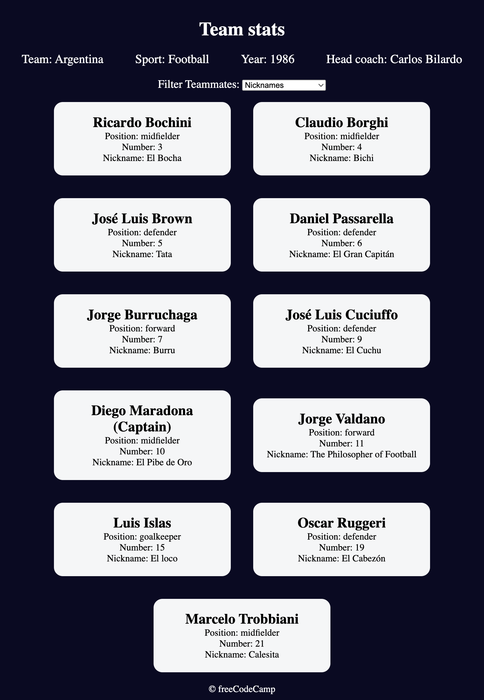

# freeCodeCamp - Football Team Cards

This is a solution to the Football Team Cards Project. 

This project covers concepts like switch statements, default parameters, Object.freeze(), the map() method, and more.
One common aspect of building web applications: processing datasets, and then outputting information to the screen. In this sports team cards project, I've learned how to work with DOM manipulation, object destructuring, event handling, and data filtering.

### The challenge

Users should be able to:

- Users can input details such as the team name, nickname, and coach, and the application generates visually appealing cards displaying this information

### Link

- Live Site URL: (https://olenahelena.github.io/football_team_cards/)

### Screenshot

